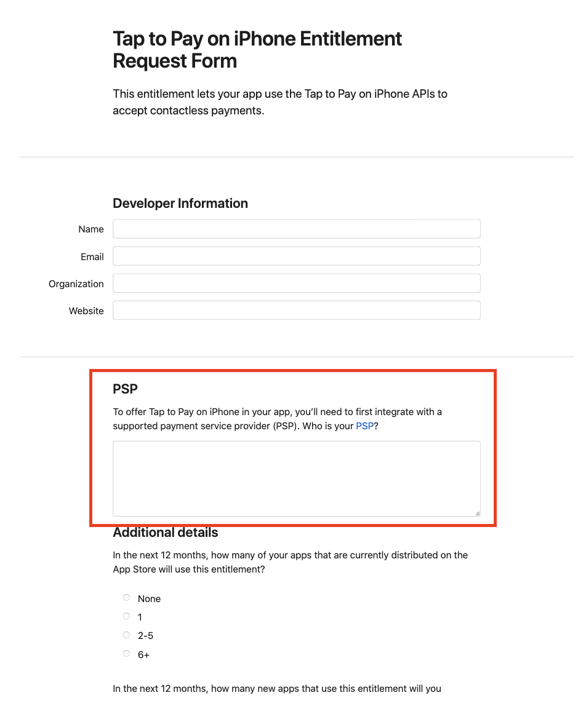

# tappay-ios-t2p-sdk

### The TapPay iOS SDK helps you build Tap to Pay on iPhone into your iOS app

## Requirement

- Tap to Pay on iPhone只支援 iPhone XS 以上機型 和 iOS 16.4 以上版本

## How to start
---
### Apply for Tap to Pay on iPhone entitlement
1. 使用account holder的帳號登入[申請頁面](https://developer.apple.com/contact/request/tap-to-pay-on-iphone/)
2. 依序填寫必要資訊
3. 在PSP的欄位中，於下圖中框選的區域填入 **"TapPay"** <br><br>
<br><br>
4. 填寫完畢後送出，申請結果通知約需等待2~5個工作天
---
### Get your App key
#### 請洽TapPay業務
---
### Install the SDK
1. 進入TPT2P-Example，複製TPSDKT2P.xcframework到您的專案下
2. 開啟您的專案，到Build Phases下，展開Link Binary With Libraries，點擊"+"並加入TPSDKT2P.xcframework
---

### Setup entitlement file
1. 新增T2P功能到開發用的Apple ID
    - 登入[Apple Developer](https://developer.apple.com/account)帳號，點選Certificates, Identifiers & Profiles
    - 在側邊欄點選Identifiers
    - 從列表中選取要導入T2P功能的App
    - 選擇Additional Capabilities<br><br>
    <br><br>
    - 勾選T2P
    - 儲存設定
    - 新增配置該App ID的provisioning profile，下載並開啟，在App專案內選擇使用該provisioning profile (如果已經新增過該provisioning profile，重新下載即可)<br><br>
2. 新增entitlements file到App專案內<br><br>
<br><br>
    - 在App專案內新增檔案，新增一個property list
    - 將檔名替換為 ___________.entitlements (檔案格式依舊為.plist)，空白部分請填入App專案名稱
    - 到Project Editor，點選Build Settings
    - 點選All和點選Combined
    - 搜尋Code Signing Entitlements<br><br>
    <br><br>
    - 輸入剛剛產生的檔案的路徑
    - 開啟該檔案，新增key為com.apple.developer.proximity-reader.payment.acceptance，value type為Boolean，value設定為true (P.S. 如果你的專案內已有.entitlements檔案，直接執行最後一步即可)<br><br>
    

---

### Setup Location Privacy Settings
因收單銀行要求：為提升交易安全，交易收款需開啟定位服務，故須於Info.plist加入privacy setting "Privacy - Location When In Use Usage Description"

---

### Sandbox環境測試用帳號建立與使用
1. 登入[App Store Connect](https://appstoreconnect.apple.com/login)，進入到使用者與存取權限頁面<br><br>
<br><br>
2. 點選沙箱技術測試人員
3. 點選+號新增測試用帳號，輸入必要資訊並建立（請使用未曾作為 Apple ID 或用來購買 iTunes 或 App Store 內容的電子郵件地址。建議你為每一位沙箱測試人員建立測試專用的電子郵件地址，詳細資訊可參考[建立沙箱 Apple ID](https://developer.apple.com/tw/help/app-store-connect/test-in-app-purchases-main/create-sandbox-apple-ids/)）
4. 建立完成後，若要在sandbox環境測試，須於測試用的裝置登入此測試用Apple ID，並重新開機
5. 屆時若需要切換為production環境測試，亦須於測試用的裝置登入非sandbox用Apple ID，並重新開機

---
## SDK initialize
 <br><br>
## Start to use SDK


---

---
  ## Initialize
  ### Initialize service with app key
  #### Function
  ```swift
  func setupWithAppKey(appKey: String!, environment: Environment!, partnerAccount: String? = nil, isInherit: Bool? = nil) async throws
  ```
  #### Sample
  ```swift
  // Sample code
  Task {
      do {
          try await TPT2PManager.shared.setupWithAppKey(appKey:"123456789", environment: .production, partnerAccount: "partnerAccount", isInherit: true)
      }catch {
          // error handling
      }
  }
  ```
  #### Parameters
  |  Parameter   | Type  |  Description   | 
  |  :----  | :----  | :---- |
  | appKey  | String | 用於SDK的驗證金鑰 |
  | environment  | Environment | 使用的伺服器種類<br>測試時請使用 Sandbox 環境 (Environment.sandbox, .sandbox)<br>實體上線後請切換至 Production 環境 (Environment.production, .production) |
  | partnerAccount  | String | (Optional) Partner Account |
  | isInherit  | Bool | (Optional) <br> true => 若該手機已有綁定terminal，SDK initialize時不會解綁該手機的綁定 <br> false => 若該手機已有綁定terminal，SDK initialize時會解綁該手機的綁定 |
  
  ---
  ## Bind
  ### Get binding status
  ```swift
  static var isReaderBinded: Bool
  ```
  #### Sample
  ```swift
  // Sample code
  if TPT2PReader.isReaderBinded == false {
      // Need to do bind process
  }else {
      // Terminal is binded already with this device
      // Reader is ready for configuring
  }
  ```
  ### Get binding list
  #### Function
  ```swift
  func getBindingList(page: Int, countPerPage: Int, merchantId: String? = nil, merchantAccount: String? = nil, terminalId: String? = nil) async throws -> [BindItem]?
  ```
  #### Sample
  ```swift
  // Sample code
  Task {
      do {
          // Get 10 bind items per page, the first page of list
          let bindList = try await TPT2PService.shared.getBindingList(page: 0, countPerPage: 10, merchantId: "merchantId", merchantAccount: "merchantAccount", terminalId: "terminalId")
      }catch {
          // error handling
      }
  }
  ```
  #### Parameters
  |  Parameter   | Type  |  Description   | 
  |  :----  | :----  | :---- |
  | page  | Int | 第幾頁 |
  | countPerPage  | Int | 每頁筆數 |
  | merchantId  | String | (Optional) TapPay商店代碼 |
  | merchantAccount  | String | (Optional) 商店代號 |
  | terminalId  | String | (Optional) 端末機代號 |

  ### Response
  #### Item detail
  ```swift
  struct BindItem: Codable {
    public let id: String?
    public let partnerId: Int
    public let acquirerId: Int
    public let acquirerName: String?
    public let acquirerIcon: String?
    public let merchantId: String?
    public let merchantAccount: String?
    public let terminalId: String?
    public let hash: String?
  }
  ```
  #### Parameters
  |  Parameter   | Type  |  Description   | 
  |  :----  | :----  | :---- |
  | id  | String | 綁定代號 |
  | partnerId  | Int | Partner代號 |
  | acquirerId  | Int | 收單機構代號 |
  | acquirerName  | Int | 收單機構名稱 |
  | acquirerIcon  | String | 收單機構logo |
  | merchantId  | String | TapPay商店代碼 |
  | merchantAccount  | String | 商店代號 |
  | terminalId  | String | 端末機代號 |
  | hash  | String | 綁定資訊 |

  ### Bind
  #### Function
  ```swift
  func bind(bindItem: BindItem, description: String?) async throws
  ```
  #### Sample
  ```swift
  // Sample code
  Task {
      do {
          try await TPT2PService.shared.bind(bindItem: BindItem(), description: "123456")
      }catch {
          // error handling
      }
  }
  ```
  #### Parameters
  |  Parameter   | Type  |  Description   | 
  |  :----  | :----  | :---- |
  | bindItem  | BindItem | 綁定資訊 |
  | description  | String | 端末機備註 |

  ### Bind delete
  #### Function
  ```swift
  func bindDelete() async throws
  ```
  #### Sample
  ```swift
  // Sample code
  Task {
      do {
          try await TPT2PService.shared.bindDelete()
      }catch {
          // error handling
      }
  }
  ```
---
  ## Prepare reader
  ### Prepare reader
  #### Function
  ```swift
  func configureReader() async throws
  ```
  #### Sample
  ```swift
  // Sample code
  Task {
      do {
          try await TPT2PReader.shared.configureReader()
      }catch {
          // error handling
      }
  }
  ```
  ### Get reader event
  #### Function
  ```swift
  protocol TPT2PReaderDelegate {
    func readerEventDidUpdated(event: (TPT2PReader.Event)?)
  }
  ```
  #### Sample
  ```swift
  // Sample code
  class ViewController: UIViewController, TPT2PReaderDelegate {

    override func viewDidLoad() {
        super.viewDidLoad()
        TPT2PReader.shared().delegate = self
    }

    func readerEventDidUpdated(event: (TPSDKT2P.TPT2PReader.Event)?) {
        // You can get reader events after updated here, for example
        if case .updateProgress(let percentage) = event {
            // Show a progress bar by percentage when the reader needs to update for seconds
        }
    }
  }
  ```
---
  ## Transaction
  ### Transaction authorization
  #### Function
  ```swift
  func readCardAndAuthorization(amount: Decimal) async throws -> Transaction?
  ```
  #### Sample
  ```swift
  // Sample code
  Task {
      do {
          let transactionResult = try await TPT2PReader.shared.readCardAndAuthorization(amount: 100)
      }catch {
          // error handling
      }
  }
  ```
  #### Parameters
  |  Parameter   | Type  |  Description   | 
  |  :----  | :----  | :---- |
  | amount  | Decimal | 交易金額 |

  ### Response
  #### Item detail
  ```swift
  struct Transaction: Codable {
    public let receiptId: String
    public let transactionId: String
    public let bankTransactionId: String
    public let orderNumber: String
    public let state: Int
    public let createTime: CLong
    public let amount: Double
    public let currency: String
    public let cardMask : String
    public let authCode: String
    public let needSignature: Bool
  }
  ```
  #### Parameters
  |  Parameter   | Type  |  Description   | 
  |  :----  | :----  | :---- |
  | receiptId  | String | 簽單編號 |
  | transactionId  | String | 交易編號 |
  | bankTransactionId  | String | 銀行交易編號 |
  | orderNumber  | String | 訂單編號（商戶系統帶入）|
  | state  | Int | 交易狀態<br>-1  : ERROR<br>0   : AUTH_SUCCESS<br>1   : SETTLE_SUCCESS<br>3  : CANCEL_SUCCESS |
  | createTime  | CLong | 訂單時間 |
  | amount  | Double | 交易金額 |
  | currency  | String | 幣別 |
  | cardMask  | String | 卡號資訊（屏蔽）|
  | authCode  | String | 授權碼 |
  | needSignature  | Bool | 交易需要簽名與否 |

  ### Upload signature
  #### Function
  ```swift
  func createElectronicSignature(receiptIdentifier: String, signCanvas: PKCanvasView) async throws
  ```
  #### Sample
  ```swift
  // Sample code
  Task {
      do {
          try await TPT2PService.shared.createElectronicSignature(receiptIdentifier: "123", signCanvas: PKCanvasView())
      }catch {
          // error handling
      }
  }
  ```
  #### Parameters
  |  Parameter   | Type  |  Description   | 
  |  :----  | :----  | :---- |
  | receiptIdentifier  | String | 簽單編號 |
  | signCanvas  | PKCanvasView | 簽名 |

---
  ## Receipt
  ### Get receipt
  #### Function
  ```swift
  func getReceipt(receiptIdentifier: String, type: Int, email: String?) async throws -> String
  ```
  #### Sample
  ```swift
  // Sample code
  Task {
      do {
          let receiptUrl = try await TPT2PService.shared.getReceipt(receiptIdentifier: "123456", type: 1, email: "test@test.com")
      }catch {
          // error handling
      }
  }
  ```
  #### Parameters
  |  Parameter   | Type  |  Description   | 
  |  :----  | :----  | :---- |
  | receiptIdentifier  | String | 簽單編號 |
  | type  | Int | 簽單瀏覽格式<br>1 : html<br>2 : pkpass |
  | email  | String | 欲收到簽單的信箱 |

  ### Response
  #### Item detail
  |  Parameter   | Type  |  Description   | 
  |  :----  | :----  | :---- |
  | receiptUrl  | String | 簽單URL |

  ### Get receipt (For backend)
  
#### 請參考 [TapPay Tap to Pay on iPhone Document for Backend](https://cherricorp.gitbook.io/tappay-tap-to-pay-on-iphone-document-for-backend/)
---
