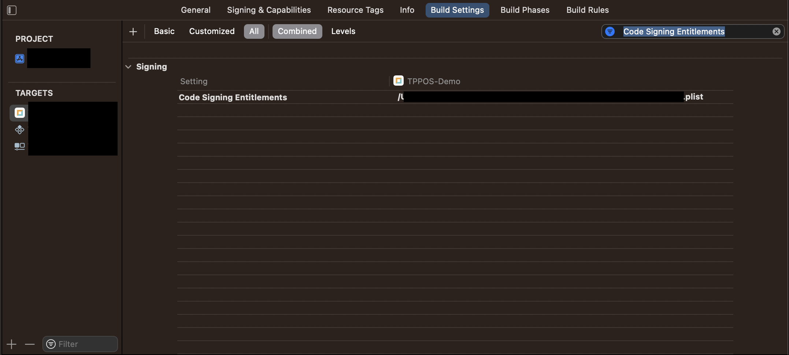
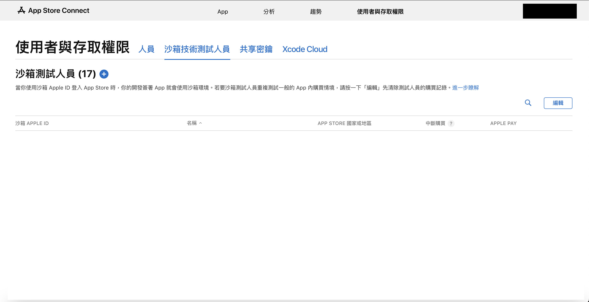

# tappay-ios-t2p-sdk

### The TapPay iOS SDK helps you build Tap to Pay on iPhone into your iOS app

## Requirement

- Tap to Pay on iPhone is only supported on iPhone XS or later models and requires iOS version 16.7 or above.

## How to start
---
### Apply for Tap to Pay on iPhone entitlement
1. Log in to the [application page](https://developer.apple.com/contact/request/tap-to-pay-on-iphone/) using the account holder's credentials.
2. Fill in the required information in order.
3. In the PSP field, enter **"TapPay"** in the area highlighted in the image below.  <br><br>
<br><br>
4. Once completed, submit the application. It will take approximately 2 to 5 business days to receive the application results.
---
### Get your App key
#### Please contact the TapPay sales representative.
---
### Install the SDK
1. Go to TPT2P-Example and copy TPSDKT2P.xcframework into your project directory.
2. Open your project, navigate to Build Phases, expand Link Binary With Libraries, click the “+” button, and add TPSDKT2P.xcframework.
---

### Setup entitlement file
1. Add the T2P feature to your development Apple ID
    - Log in to your [Apple Developer](https://developer.apple.com/account) account and navigate to Certificates, Identifiers & Profiles.
    - In the sidebar, click Identifiers.
    - From the list, select the app to which you want to add the T2P feature.
    - Scroll down and enable Additional Capabilities.<br><br>
    <br><br>
    - Check T2P to enable the feature.
    - Save the configuration.
    - Create a new provisioning profile for the updated App ID, download and open it.
    - In your Xcode project, select this provisioning profile for the app. 
 (If the provisioning profile has already been created, simply re-download it.)<br><br>
2. Add an entitlements file to your app project.<br><br>
<br><br>
    - In your app project, add a new file and choose Property List as the file type.
    - Rename the file to ____________. entitlements (the file format remains .plist). Replace ____________ with the actual name of your app project.
    - Go to the Project Editor and select the Build Settings tab.
    - Make sure both All and Combined are selected.
    - Search for Code Signing Entitlements.<br><br>
    <br><br>
    - Enter the file path of the entitlements file you just created.
    - Open the file and add a new key: 
 com.apple.developer.proximity-reader.payment.acceptance 
 Set the value type to Boolean, and the value to true. 
 (P.S. If your project already has an existing. entitlements file; you can skip the earlier steps and proceed directly with this key addition.)<br><br>
    

---

### Setup Location Privacy Settings
Due to acquiring bank requirements: 
To enhance transaction security, location services must be enabled for payment processing. Therefore, you need to add the following privacy setting to Info.plist: Privacy - Location When In Use Usage Description

---

### Creating and Using a Sandbox Test Account
1. Log in to [App Store Connect](https://appstoreconnect.apple.com/login) and navigate to the Users and Access page.<br><br>
<br><br>
2. Click on Sandbox Testers.
3. Click the “+” button to add a new test account. Enter the required information and create an account. 
 (Please use an email address that has never been used as an Apple ID or for purchasing content from iTunes or the App Store. It is recommended to create a dedicated email address for each sandbox test. For more information, refer to [Creating a Sandbox Apple ID](https://developer.apple.com/tw/help/app-store-connect/test-in-app-purchases-main/create-sandbox-apple-ids/).)
4. Once the account is created, to perform testing in the sandbox environment, sign in to the test device using the sandbox Apple ID and restart the device.
5. If you need to switch back to production environment testing, sign in to the test device using a non-sandbox Apple ID and restart the device.

---
## SDK initialize
 <br><br>
## Start to use SDK


---

---
  ## Initialize
  ### Initialize service with app key
  #### Function
  ```swift
  func setupWithAppKey(appKey: String!, environment: Environment!, partnerAccount: String? = nil, isInherit: Bool? = nil) async throws
  ```
  #### Sample
  ```swift
  // Sample code
  Task {
      do {
          try await TPT2PManager.shared.setupWithAppKey(appKey:"123456789", environment: .production, partnerAccount: "partnerAccount", isInherit: true)
      }catch {
          // error handling
      }
  }
  ```
  #### Parameters
  |  Parameter   | Type  | Required  |  Description   | 
  |  :----  | :---- | :---- | :---- |
  | appKey  | String | Y | The credential key used for SDK authentication. |
  | environment  | Environment | Y | The server environment type.<br>Use the Sandbox environment for testing: Environment.sandbox, .sandbox<br>Switch to Production for live environment: Environment.production, .production |
  | partnerAccount  | String | N | Partner Account |
  | isInherit  | Bool | N | Determines whether to skip unbinding during SDK initialization.<br>true → The SDK will not unbind during initialize. (e.g., use case: the app is already logged in, and a terminal is already bound)<br> false → The SDK will unbind during initialize. (e.g., use case: you want to ensure whether the current binding status is correct. It's recommended to unbind first.) |
  
  ---
  ## Bind
  ### Get binding status
  ```swift
  static var isReaderBinded: Bool
  ```
  #### Sample
  ```swift
  // Sample code
  if TPT2PReader.isReaderBinded == false {
      // Need to do bind process
  }else {
      // Terminal is binded already with this device
      // Reader is ready for configuring
  }
  ```
  ### Get binding list
  #### Function
  ```swift
  func getBindingList(page: Int, countPerPage: Int, merchantAccount: String? = nil, terminalId: String? = nil) async throws -> [BindItem]?
  ```
  #### Sample
  ```swift
  // Sample code
  Task {
      do {
          // Get 10 bind items per page, the first page of list
          let bindList = try await TPT2PService.shared.getBindingList(page: 0, countPerPage: 10, merchantAccount: "merchantAccount", terminalId: "terminalId")
      }catch {
          // error handling
      }
  }
  ```
  #### Parameters
  |  Parameter   | Type  | Required |  Description   | 
  |  :----  | :---- | :---- | :---- |
  | page  | Int | Y | Page number. |
  | countPerPage  | Int | Y | Number of records per page. |
  | acquirerMerchantId  | String | N | Acquiring institution’s merchant ID. |
  | acquirerTerminalId  | String | N | Acquiring institution’s terminal ID. |

  ### Response
  #### Item detail
  ```swift
  struct BindItem: Codable {
    public let terminalId: Int
    public let partnerId: Int
    public let acquirerId: Int
    public let acquirerName: String
    public let acquirerIcon: String
    public let acquirerMerchantId: String
    public let acquirerTerminalId: String
    public let type: Int
    public let name: String?
    public let description: String?
    public let hash: String
  }
  ```
  #### Parameters
  |  Parameter   | Type  |  Description   | 
  |  :----  | :----  | :---- |
  | terminalId  | Int | System transaction sequence number. |
  | partnerId  | Int | Partner ID. |
  | acquirerId  | Int | Acquire institution ID. |
  | acquirerName  | Int | Acquire institution name. |
  | acquirerIcon  | String | Acquire institution icon. |
  | acquirerMerchantId  | String | Acquire institution’s merchant ID. |
  | acquirerTerminalId  | String | Acquire terminal ID. |
  | type  | Int | Acquire transaction type:<br>0: General transaction<br>1: Installment transaction<br>2: General + Installment transaction |
  | name  | String | Name to be displayed on the terminal. |
  | description  | String | Terminal description. |
  | hash  | String | Binding token data. |

  ### Bind
  #### Function
  ```swift
  func bind(bindItem: BindItem, description: String? = nil) async throws // It will be deprecated in the next version.
  func bind(bindItem: BindItem) async throws
  ```
  #### Sample
  ```swift
  // Sample code
  Task {
      do {
          try await TPT2PService.shared.bind(bindItem: BindItem())
      }catch {
          // error handling
      }
  }
  ```
  #### Parameters
  |  Parameter   | Type  | Required |  Description   | 
  |  :----  | :----  | :---- | :---- |
  | bindItem  | BindItem | Y | Binding information. |
  | description  | String | N | Terminal description. |

  ### Bind delete
  #### Function
  ```swift
  func bindDelete() async throws
  ```
  #### Sample
  ```swift
  // Sample code
  Task {
      do {
          try await TPT2PService.shared.bindDelete()
      }catch {
          // error handling
      }
  }
  ```
---
  ## Prepare reader
  ### Prepare reader
  #### Function
  ```swift
  func configureReader() async throws
  ```
  #### Sample
  ```swift
  // Sample code
  Task {
      do {
          try await TPT2PReader.shared.configureReader()
      }catch {
          // error handling
      }
  }
  ```
  ### Start configuring reader callback
  #### Function
  ```swift
  protocol TPT2PReaderDelegate {
    func startConfiguring(reader: TPT2PReader)
  }
  ```
  #### Sample
  ```swift
  // Sample code
  class ViewController: UIViewController, TPT2PReaderDelegate {

    override func viewDidLoad() {
        super.viewDidLoad()
        TPT2PReader.shared().delegate = self
    }

    func startConfiguring(reader: TPT2PReader) {
        // Do something when reader started configuring, ex. show indicator
    }
  }
  ```
  ### End configuring reader callback
  #### Function
  ```swift
  protocol TPT2PReaderDelegate {
    func endConfiguring(reader: TPT2PReader, error: TPT2PError?)
  }
  ```
  #### Sample
  ```swift
  // Sample code
  class ViewController: UIViewController, TPT2PReaderDelegate {

    override func viewDidLoad() {
        super.viewDidLoad()
        TPT2PReader.shared().delegate = self
    }

    func endConfiguring(reader: TPSDKT2P.TPT2PReader, error: TPSDKT2P.TPT2PError?) {
        // Do something when reader finished configuring
    }
  }
  ```
  
  ### Get reader event
  #### Function
  ```swift
  protocol TPT2PReaderDelegate {
    func readerEventDidUpdated(event: (TPT2PReader.Event)?)
  }
  ```
  #### Sample
  ```swift
  // Sample code
  class ViewController: UIViewController, TPT2PReaderDelegate {

    override func viewDidLoad() {
        super.viewDidLoad()
        TPT2PReader.shared().delegate = self
    }

    func readerEventDidUpdated(event: (TPSDKT2P.TPT2PReader.Event)?) {
        // You can get reader events after updated here, for example
        if case .updateProgress(let percentage) = event {
            // Show a progress bar by percentage when the reader needs to update for seconds
        }
    }
  }
  ```
  ### Tap to Pay on iPhone Button
  #### Sample
  ```swift
  // Sample code
  class ViewController: UIViewController {

    override func viewDidLoad() {
        super.viewDidLoad()

        let tapToPayButton = TPT2PReaderButton()
        // The recommand width is 343, and you don't have to setup height because the button designed with a fix ratio
        tapToPayButton.frame = CGRect(x: 0, y: 0, width: 343, height: 0)
        tapToPayButton.center = view.center
        view.addSubview(tapToPayButton)
        tapToPayButton.onClick = {
            // You can call read readCardAndAuthorization() in this closure
        }
    }

  }
  ```
---
  ## Transaction
  ### Get installment info
  You can first use the SDK to retrieve the list of supported issuers and installment periods.<br>The app frontend can then present the user with options to select the issuer, installment period, and the corresponding installment product code.<br>For example:<br>
  - Use 0300 for 3-month installments.
  - Use 1200 for 12-month installments.
  #### Function
  ```swift
  func getInstallmentInfo() async throws -> [IssuerItem]?
  ```
  #### Sample
  ```swift
  // Sample code
  Task {
      do {
          let transactionResult = try await TPT2PService.shared.getInstallmentInfo()
      }catch {
          // error handling
      }
  }
  ```

  ### Response
  #### Issuer Item
  ```swift
  struct IssuerItem: Codable {
    public let issuerCode: String?
    public let name: String?
    public let displayName: String?
    public let icon: String?
    public let codes:[CodeItem]?
  }
  ```
  #### Parameters
  |  Parameter   | Type  |  Description   | 
  |  :----  | :----  | :---- |
  | issuerCode  | String | Issuer code. |
  | name  | String | Issuer name. |
  | displayName  | String | Issuer display name. |
  | icon  | String | Issuer icon. |
  | codes  | Array<CodeItem> | Supported installment product codes. |

  #### Code Item
  ```swift
  struct CodeItem: Codable {
    public let code: String
    public let period: Int
    public let name: String
    public let description: String?
  }
  ```
  #### Parameters
  |  Parameter   | Type  |  Description   | 
  |  :----  | :----  | :---- |
  | code  | String | Installment product code. |
  | period  | Int | Number of installment periods. |
  | displayName  | String | Issuer display name.  |
  | name  | String | Installment name. |
  | description  | String | Installment description. |
  
  ### Transaction authorization
  #### Function
  ```swift
  func readCardAndAuthorization(amount: Decimal, installmentCode: String? = nil, orderNumber: String? = nil, bankTransactionId: String? = nil) async throws -> Transaction?
  ```
  #### Sample
  ```swift
  // Sample code
  Task {
      do {
          let transactionResult = try await TPT2PReader.shared.readCardAndAuthorization(amount: 100, installmentCode: "0300" orderNumber: "orderNumber", bankTransactionId: "bankTransactionId")
      }catch {
          // error handling
      }
  }
  ```
  #### Parameters
  |  Parameter   | Type  | Required |  Description   | 
  |  :----  | :----  | :---- | :---- |
  | amount  | Decimal | Y | Transaction amount. |
  | installmentCode  | String | N | Installment product code.<br>Example: 3 installments → 0300 |
  | orderNumber  | String | N | Order number (provided by merchant system). |
  | bankTransactionId  | String | N | Bank transaction ID. |

  ### Response
  #### Item detail
  ```swift
  struct Transaction: Codable {
    public let receiptId: String
    public let transactionId: String
    public let bankTransactionId: String
    public let orderNumber: String
    public let state: Int
    public let createTime: CLong
    public let amount: Double
    public let currency: String
    public let cardMask : String
    public let authCode: String
    public let needSignature: Bool
  }
  ```
  #### Parameters
  |  Parameter   | Type  |  Description   | 
  |  :----  | :----  | :---- |
  | receiptId  | String | Receipt ID. |
  | transactionId  | String | Transaction ID. |
  | bankTransactionId  | String | Bank transaction ID. |
  | orderNumber  | String | Order number (provided by merchant system). |
  | state  | Int | Transaction status:<br>-1  : ERROR<br>0   : AUTH_SUCCESS<br>1   : SETTLE_SUCCESS<br>3  : CANCEL_SUCCESS |
  | createTime  | CLong | Transaction timestamp. |
  | amount  | Double | Transaction amount. |
  | currency  | String | Currency. |
  | cardMask  | String | Masked card number (for display). |
  | authCode  | String | Authorization code. |
  | needSignature  | Bool | Whether a signature is required. |

  ### Cancel Read Process
  #### Function
  ```swift
  func func cancelReadProcess() async throws
  ```
  #### Sample
  ```swift
  // Sample code
  Task {
      do {
          try await TPT2PReader.shared.cancelReadProcess()
      }catch {
          // error handling
      }
  }
  ```

  ### Upload signature
  #### Function
  ```swift
  func createElectronicSignature(receiptIdentifier: String, signCanvas: PKCanvasView) async throws
  ```
  #### Sample
  ```swift
  // Sample code
  Task {
      do {
          try await TPT2PService.shared.createElectronicSignature(receiptIdentifier: "123", signCanvas: PKCanvasView())
      }catch {
          // error handling
      }
  }
  ```
  #### Parameters
  |  Parameter   | Type  | Required |  Description   | 
  |  :----  | :----  | :---- | :---- |
  | receiptIdentifier  | String | Y | Receipt identifier. |
  | signCanvas  | PKCanvasView | Y | Signature. |

---
  ## Receipt
  ### Get receipt
  #### Function
  ```swift
  func getReceipt(receiptIdentifier: String, type: Int? = nil, email: String? = nil) async throws -> String // It will be deprecated in the next version.
  func getReceipt(receiptIdentifier: String, email: String? = nil) async throws -> String
  ```
  #### Sample
  ```swift
  // Sample code
  Task {
      do {
          let receiptUrl = try await TPT2PService.shared.getReceipt(receiptIdentifier: "123456", email: "test@test.com")
      }catch {
          // error handling
      }
  }
  ```
  #### Parameters
  |  Parameter   | Type  | Required |  Description   | 
  |  :----  | :----  | :---- | :---- |
  | receiptIdentifier  | String | Y | Receipt identifier. |
  | type  | Int | N | Receipt viewing format:<br>1 : html<br>2 : pkpass |
  | email  | String | N | Email address to receive the receipt. |

  ### Response
  #### Item detail
  |  Parameter   | Type  |  Description   | 
  |  :----  | :----  | :---- |
  | receiptUrl  | String | Receipt URL. |

  ### Get receipt list
  #### Function
  ```swift
  func getReceiptList(transactionIdentifier: String, transactionType: [TransactionType]? = nil) async throws -> ReceiptList?
  ```
  #### Sample
  ```swift
  // Sample code
  Task {
      do {
          let receiptList = try await TPT2PService.shared.getReceiptList(transactionIdentifier: "XXX", transactionType: [.sale, .void])
      }catch {
          // error handling
      }
  }
  ```
  #### Parameters
  |  Parameter   | Type  | Required |  Description   | 
  |  :----  | :----  | :---- | :---- |
  | transactionIdentifier  | String | Y | Transaction identifier. |
  | transactionType  | TransactionType | N | Transaction type:<br>sale: Sale<br>void : Authorization cancellation |

  ### Response
  #### Item detail
  |  Parameter   | Type  |  Description   | 
  |  :----  | :----  | :---- |
  | receiptId  | String | Receipt identifier. |
  | transactionType  | TransactionType | Transaction type:<br>sale: Sale<br>void: Authorization cancellation |
  | createTime  | CLong | Receipt creation timestamp. |
  | amount  | Double | Transaction amount. |
  | currency  | String | Currency. |
  | needSignature  | Bool | Whether a signature is required. |
  | receiptUrl  | String | Receipt URL. |

  ### Get receipt (For backend)
  
#### 請參考 [TapPay Tap to Pay on iPhone Document for Backend](https://cherricorp.gitbook.io/tappay-tap-to-pay-on-iphone-document-for-backend/)
---
